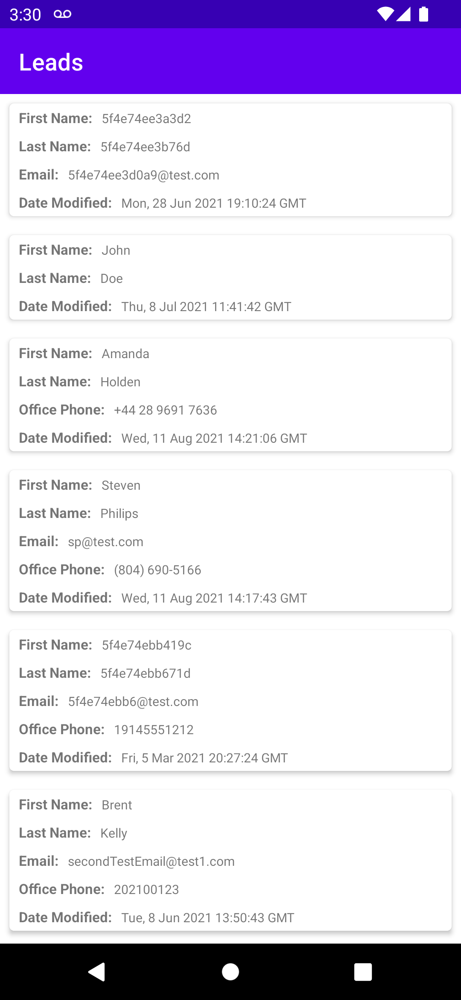

# Fueled Android Challenge

> This repository is archived to prevent accidentally creating a PR against it.

The project is a CRM system that allows you to create Records and store data on those Records. Each user on the system can create their own set of `fields` for these records, and their own `Group` of records, that is not known at runtime. The UI is server driven, with the back end providing information on what fields should be displayed and what data type each of these fields are. The following endpoints are available:

+ `group_info` -> Provides information on how many `Record`s exist within the group, and what `fields` should be displayed for each `Record`, in what order.
+ `group_meta` -> Provides MetaData on all of the `fields` available within the group. Note that this call could contain thousands of entries for field meta data.
+ `group_data` -> Provides the raw data of all of the `Record` objects.

### Objective
The organization needs to allow a user to see all of their `Record`s with the relevant information.
- Develop a single screen application that displays the `Record`s on the screen, ensuring to only display the fields as provided by the back end.
- The base application has been started for you, with the endpoints all being provided by a dummy api class `CrmApi`.
- Parts of the UI have started undergoing development by a junior on the team.
- Consider that the data may need to be updated at a later stage by the mobile app (not in this scope). Bear this in mind when mapping the data  
- Display the list of Records, ensuring to also render the correct fields in the correct order.
  - The UI should contain the title of the group in the toolbar, with the list of records displayed below.
  - Any record whose fields are empty / null, should _not_ be displayed on that record.
  - Ensure to map the field values correctly based on their field type. For example, timestamp fields should be displayed in `RFC_1123_DATE_TIME` format.
  - Ensure you consider performance when mapping data, bearing in mind that some of these data sets can be large.
  
Your final output should look something like below:
 

Instead of connecting to a remote API, we are providing this data in form of JSON files, which have been made accessible through the `CrmApi` class. The raw json responses can be located in the `res/raw` directory.

### What we're looking to evaluate
1. How you choose to architect your application and how you manage threads.
2. How you choose to model your data
3. How you transform the provided JSON data to your data model
4. How you use your models to construct the objects to be displayed.
5. How you consider performance when dealing with potentially large data sets.
6. What efforts your take on the UI to touch up any issues that may exist with the current implementation.

### Instructions
1. Clone this repo (**Do not fork**) to a repo on your own Github account and **make it private**
2. Invite user `fueledbot` to collaborate on that repo
3. Address each step of the problem above and commit as necessary
4. Once you are finished, open a PR on your work and assign `fueledbot` as the reviewer and notify your Fueled contact via email

### Duration
Out of respect for your time, we ask that you limit the amount you spend on this assignment to up to 10 hours. However, out of respect for us, we also expect you to submit the completed exercise within a week of it being assigned to you. Thank you, and best of luck!